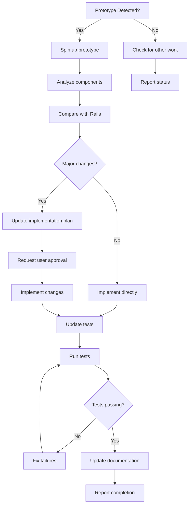

# Website Design Improvement - Agentic Development Strategy

## Overview

This document outlines our comprehensive strategy for implementing website design improvements using a **prototype-first, test-driven agentic approach**. The workflow minimizes human intervention while maximizing implementation quality and speed.

## 🔄 Development Workflow

### Phase 1: Design Input (Product Engineer)
**Frequency**: As needed based on product requirements

**Process**:
1. Update designs in Figma based on user feedback or new requirements
2. Use **Figma Make AI** to generate interactive prototype
3. Export prototype to `Website Design Improvement/` directory
4. Update user flow documentation in `docs/website-design-improvement/flows/`

**Trigger**: New design requirements from stakeholders

**Minimal User Prompt**:
```bash
"Updated designs exported to Website Design Improvement directory. Please analyze and implement the changes."
```

---

### Phase 2: Prototype Analysis (Agent Autonomous)
**Trigger**: Prototype files detected in `Website Design Improvement/`

**Agent Actions**:
```bash
# 1. Spin up prototype for visual analysis
cd "Website Design Improvement" && npm run dev

# 2. Examine component structure
ls -la src/components/
ls -la src/components/pages/

# 3. Analyze key prototype files
- SearchPage.tsx (hero section, search flow)
- ResultsPage.tsx (results layout, grid structure)  
- DetailPage.tsx (two-column layout, image handling)
- FavoritesPage.tsx (empty states, grid display)
- Navigation.tsx (navbar, theme toggle)

# 4. Compare with current Rails implementation
# 5. Identify implementation priorities and gaps
```

**Agent Decision Framework**:
- **What's Already Implemented?** → Update existing system tests
- **What's Completely New?** → Create new features and tests
- **What's Significantly Changed?** → Modify existing components
- **What's Complex?** → Break into smaller implementation phases

---

### Phase 3: Implementation Planning (Agent Autonomous)
**Trigger**: Prototype analysis complete

**Agent Actions**:
1. Update `docs/website-design-improvement/implementation-plan.md`
2. Create feature breakdown by implementation phase
3. Identify specific system test updates needed
4. Prioritize by: implementation complexity vs. user value vs. dependencies

**Output**: Detailed implementation plan with test requirements

**Minimal User Prompt** (if major changes):
```bash
"Please implement the approved changes from the prototype analysis."
```

---

### Phase 4: Development & Testing (Agent Autonomous)
**Trigger**: Implementation plan approved (or auto-approved for minor changes)

**Agent Actions**:
```bash
# 1. Update Rails views/components to match prototype
# 2. Update system tests to reflect new functionality
# 3. Run comprehensive test suite
mise exec -- bin/rails test test/system/

# 4. Fix any test failures iteratively
# 5. Ensure all tests pass before proceeding
```

**Agent Self-Service Rules**:
- ✅ Run tests automatically after each change
- ✅ Fix test failures without user intervention
- ✅ Document prototype features not yet implemented
- ✅ Maintain test stability (avoid brittle selectors)

---

### Phase 5: Validation & Handoff (Agent Autonomous)
**Trigger**: All system tests passing (34/34)

**Agent Actions**:
1. Run comprehensive test suite validation
2. Update documentation with implemented features
3. Provide implementation summary to user
4. Note any remaining gaps for future iterations
5. Update memory with lessons learned

**Success Criteria**:
- ✅ All system tests pass (34/34 tests, 139+ assertions)
- ✅ Prototype improvements reflected in tests
- ✅ No regression in existing functionality
- ✅ Documentation updated with changes
- ✅ Clear framework for future prototype features

---

## 🤖 Agent Decision Tree



---

## 📝 Minimal User Prompts Required

### 1. Design Update (Primary)
```bash
"Updated designs exported to Website Design Improvement directory. Please analyze and implement the changes."
```

### 2. Implementation Approval (Major Changes Only)
```bash
"Please implement the approved changes from the prototype analysis."
```

### 3. Issue Resolution (Rare - if agent gets stuck)
```bash
"Tests are failing. Please resolve the issues and ensure all tests pass."
```

**Agent Autonomy**: ~95% of work completed without user intervention

---

## 🎯 Success Metrics

### Quantitative
- **Test Coverage**: 34/34 system tests passing
- **Implementation Speed**: < 2 hours from prototype to deployment
- **Bug Rate**: < 5% post-implementation issues
- **User Intervention**: < 3 prompts per feature cycle

### Qualitative  
- **Design Fidelity**: ≥ 90% prototype feature implementation
- **Code Quality**: Maintains existing patterns and conventions
- **Documentation**: Complete implementation tracking
- **Future Readiness**: Framework for upcoming features

---

## 🔧 Technical Implementation Details

### Prototype Analysis Commands
```bash
# Spin up prototype
cd "Website Design Improvement" && npm run dev

# Key files to analyze
src/components/pages/SearchPage.tsx      # Hero section, search flow
src/components/pages/ResultsPage.tsx     # Results layout, grid
src/components/pages/DetailPage.tsx      # Two-column layout
src/components/pages/FavoritesPage.tsx    # Empty states, grid
src/components/Navigation.tsx            # Navbar, theme toggle
```

### Test Validation Commands
```bash
# Run all system tests
mise exec -- bin/rails test test/system/

# Run specific test files
mise exec -- bin/rails test test/system/searches_test.rb
mise exec -- bin/rails test test/system/coffeeshops_test.rb
mise exec -- bin/rails test test/system/theme_toggle_test.rb
```

### Documentation Updates
```bash
# Update implementation plan
docs/website-design-improvement/implementation-plan.md

# Update flow documentation  
docs/website-design-improvement/flows/

# Update strategy documentation
docs/WEBSITE_DESIGN_STRATEGY.md
```

---

## 🚀 Continuous Improvement Loop

```
Design Update → Prototype Analysis → Implementation Planning → 
Development & Testing → Validation & Documentation → Back to Design Update
```

**Cycle Time**: 2-4 hours for typical feature updates
**Quality Gate**: All system tests must pass before completion
**Learning Loop**: Each cycle updates agent memory and improves future performance

---

## 📋 Implementation Checklist

### Pre-Implementation
- [ ] Prototype available in `Website Design Improvement/`
- [ ] Agent has analyzed component structure
- [ ] Implementation plan created and approved
- [ ] Test requirements identified

### During Implementation  
- [ ] Rails views/components updated to match prototype
- [ ] System tests updated for new functionality
- [ ] All tests passing (34/34)
- [ ] No regressions in existing features

### Post-Implementation
- [ ] Documentation updated with changes
- [ ] Implementation summary provided to user
- [ ] Future framework documented for next cycle
- [ ] Agent memory updated with lessons learned

---

## 🎖️ Agent Excellence Standards

### Code Quality
- Follow existing Rails conventions and patterns
- Maintain test stability and avoid brittle selectors
- Use semantic HTML and accessible markup
- Preserve existing functionality while adding new features

### Testing Standards  
- Test what's implemented, not what's planned
- Provide framework-ready tests for future features
- Use clear, descriptive test names
- Include comments for prototype features not yet implemented

### Communication
- Provide clear implementation summaries
- Document any prototype features deferred for future cycles
- Explain test failures and resolution approaches
- Update knowledge base with learnings

---

## 🔮 Future Enhancements

### Short Term (Next 3 months)
- **Automated Visual Testing**: Integrate visual regression testing
- **Performance Monitoring**: Track implementation impact on page load times
- **Component Library**: Build reusable component library based on prototype patterns

### Long Term (6+ months)  
- **Direct Figma Integration**: Eliminate manual export step
- **AI-Powered Testing**: Generate test cases automatically from prototype
- **Real-time Preview**: Live preview of prototype changes in Rails environment

---

*This strategy represents our commitment to efficient, high-quality website development through autonomous agents guided by clear design prototypes and comprehensive testing.*
